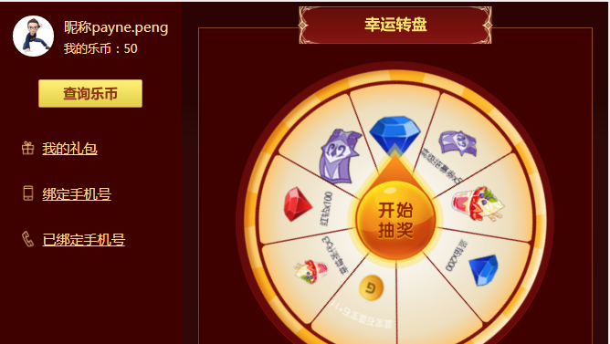
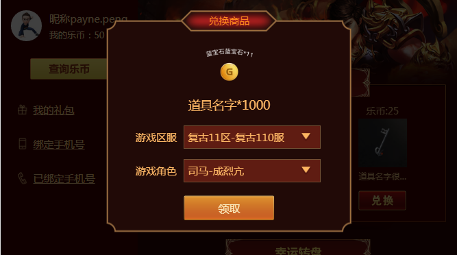
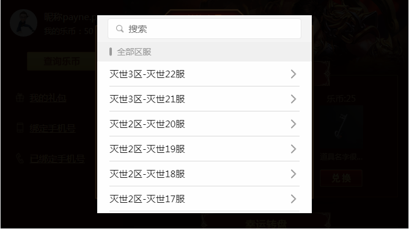
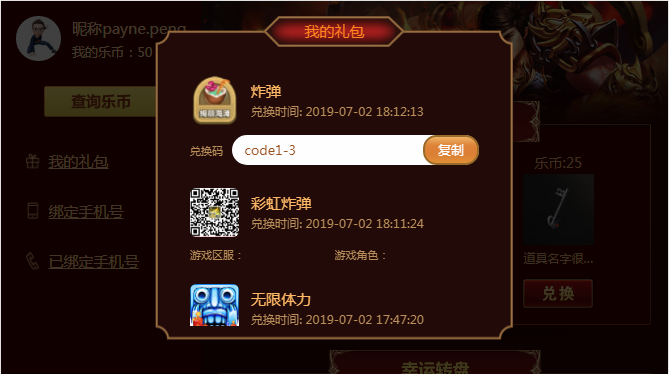
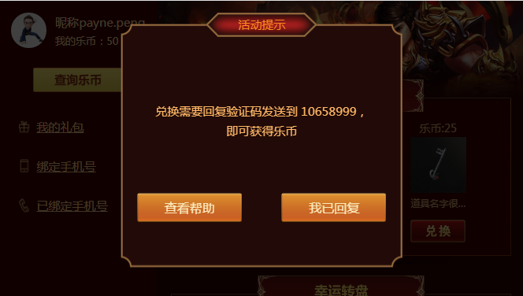

# 积分转盘活动

# 功能
> * 1、全局less变量common.less
> * 2、组件化
> * 3、静态资源js,css,图片放在cdn
> * 4、微信授权与分享
> * 5、禁止弹窗滚动穿透popitem.vue
> * 6、使用yapi-mock模拟数据
> * 7、vue-virtual-scroll-list长列表优化，区服列表数据过多
> * 8、封装全局组件Toast、Loading、Pop

# 效果预览

<div align="center">



</div>


## Build Setup

``` bash
# install dependencies
npm install

# serve with hot reload at localhost:8080
npm run dev

# build for production with minification
npm run build

# build for production and view the bundle analyzer report
npm run build --report
```

For a detailed explanation on how things work, check out the [guide](http://vuejs-templates.github.io/webpack/) and [docs for vue-loader](http://vuejs.github.io/vue-loader).
